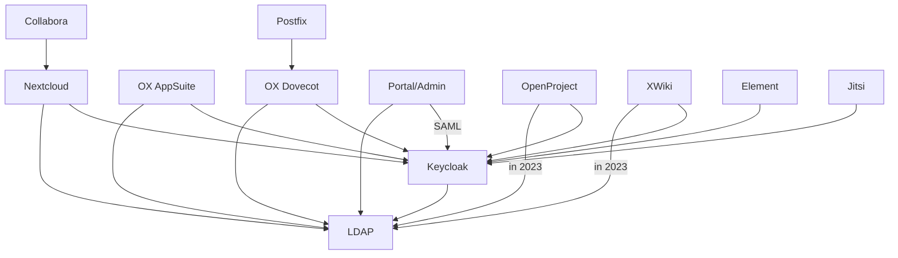

<!--
SPDX-FileCopyrightText: 2023 Bundesministerium des Innern und für Heimat, PG ZenDiS "Projektgruppe für Aufbau ZenDiS"
SPDX-License-Identifier: Apache-2.0
-->
**Content / Quick navigation**

[[_TOC_]]

# Disclaimer July 2023

The current state of the SWP is missing two components that are not yet generally available to the public also
outside the SWP (Element Starter Edition and Open-Xchange App Suite 8), and contains components that will be replaced
(e.g. UCS container monolith to be replaced by multiple Univention Management Stack containers).
In the next months we not only expect upstream updates of the functional components within their feature scope but we
are going to address operational issues like monitoring and network policies.

Of course we will extend the documentation and would love to get [feedback from you](https://gitlab.opencode.de/bmi/souveraener_arbeitsplatz/info/-/blob/main/OVERVIEW.md#mitwirkung-und-beteiligung) regarding the areas you require more details on. But be sure also without that feedback the documentation will grow.

The first release of the SWP is scheduled for December 2023.

# The Sovereign Workplace (SWP)

The SWP's runtime environment is [Kubernetes](https://kubernetes.io/), often written in it's short form "K8s".

While not all components are perfectly shaped for the execution as containers, one of the projects objectives is the
make the applications more aligned with best practise when it comes to container design and operations.

This documentation gives you - hopefully - all you need to setup your own instance of the SWP. You should have at least
basic knowledge Kubernetes and Devops knowledge.

To have an overview of what can be found at Open CoDE and the basic components of the SWP, please check out the
[OVERVIEW.md](https://gitlab.opencode.de/bmi/souveraener_arbeitsplatz/info/-/blob/main/OVERVIEW.md) in the
[Info repository](https://gitlab.opencode.de/bmi/souveraener_arbeitsplatz/info).

Especially check out the section
["Mitwirkung und Beteiligung"](https://gitlab.opencode.de/bmi/souveraener_arbeitsplatz/info/-/blob/main/OVERVIEW.md#mitwirkung-und-beteiligung)
if you are missing something or you have questions. We appreciate your feedback to improve product and documentation.

## Prerequisites

### Mandatory technical prerequisites

You have to take care about the following prerequisites in order to deploy the SWP:

- Vanilla K8s cluster
- Domain and DNS Service
- Ingress controller (supported are nginx-ingress, ingress-nginx, HAProxy)
- [Helm](https://helm.sh/), [HelmFile](https://helmfile.readthedocs.io/en/latest/) and
[HelmDiff](https://github.com/databus23/helm-diff)
- Volume provisioner supporting RWO (read-write-once) and RWX (read-write-many)
- Certificate handling with [cert-manager](https://cert-manager.io/)
- [Istio](https://istio.io/) is currently required to deploy and operate OX AppSuite8, we are working with Open-Xchange
to get rid of this component.

#### TLS Certificate

The setup will create a `cert-manager.io` Certificate resource.

You can set the ClusterIssuer via `certificate.issuerRef.name`

### Required input variables

You need to expose following variables to run the installation.

| name                | default                      | description                                       |
|---------------------|------------------------------|---------------------------------------------------|
| `DOMAIN`            | `souvap-univention.de`       | External reachable TLD                            |
| `ISTIO_DOMAIN`      | `istio.souvap-univention.de` | External reachable TLD for Istio Gateway          |
| `MASTER_PASSWORD`   | `sovereign-workplace`        | The password that seeds the autogenerated secrets |
| `SMTP_PASSWORD`     |                              | Password for STMP relay gateway                   |
| `TURN_CREDENTIALS`  |                              | Credentials for coturn server                     |

Please ensure you have set DNS records pointing to the respective loadbalancer/IP for `DOMAIN` and `ISTIO_DOMAIN`.

If you want inbound mail also MX records that point to the Postfix's pods public IP.

More details on the DNS options incl. SPF/DKIM and autodiscovery options to come...

### Optional or feature based prerequisites

All of these requirements are optional as long as you do not want to make use of the given feature.

| Feature                      | Component(s)   | Requirement         |
|------------------------------|----------------|---------------------|
| Sending outbound emails      | Various        | SMTP relay/gateway  |
| S/MIME Support               | OX AppSuite8   | PKI / CI            |
| Improved videoconferencing   | Jitsi          | STUN/TURN server    |

## Deployments

### CI based

The project includes a `.gitlab-ci.yml` that allows you to execute the deployment from a Gitlab instance of your choice.

Please ensure you provide the variables listed in the `Required input variables` section. When starting the CI through
the Gitlab UI you will be queried for some of the variables, but the variable `ISTIO_DOMAIN` will be derived
automatically by prefixing `DOMAIN` with `istio.`. Other variables you are not asked for when triggering the CI you may
want to set in the projects `Settings` > `CI/CD` > `Variables`.

### Local

Please ensure you have set the `Required input variables` (see section above) and have also read the `Helmfile` section below for non default configurations. Then go with

```shell
helmfile apply -n <NAMESPACE>
```

and wait. After the deployment are finished some bootstrapping is executed which might take some more minutes before you can login.

## Logging in

Once you have successfully deployed the SWP you should see the portal's login page at `https://portal.<DOMAIN>`.

Off the shelf you get two accounts with passwords you can lookup in the `univention-corporate-container-*` pod environment:

| Username / Login   | Password environment variable  |
|--------------------|--------------------------------|
| default.user       | DEFAULT_ACCOUNT_USER_PASSWORD  |
| default.admin      | DEFAULT_ACCOUNT_ADMIN_PASSWORD |

## Helmfile

### Custom Configuration

#### Deployment selection

By default all components are deployed. The components of type `Eval` are used for development and evaluation
purposes only and need to be replaced in production deployments. These components are grouped together in the
subdirectory `/helmfile/apps/services`.

| Component                   | Name                                | Default | Description                  | Type       |
|-----------------------------|-------------------------------------|---------|------------------------------|------------|
| Certificates                | `certificates.enabled`              | `true`  | TLS certificates             | Eval       |
| ClamAV                      | `clamav.enabled`                    | `true`  | Antivirus engine             | Eval       |
| Collabora                   | `collabora.enabled`                 | `true`  | Weboffice                    | Functional |
| Dovecot                     | `dovecot.enabled`                   | `true`  | Mail backend                 | Functional |
| Intercom Service            | `intercom.enabled`                  | `true`  | Cross service data exchange  | Functional |
| Jitsi                       | `jitsi.enabled`                     | `true`  | Videoconferencing            | Functional |
| Keycloak                    | `keycloak.enabled`                  | `true`  | Identity Provider            | Functional |
| MariaDB                     | `mariadb.enabled`                   | `true`  | Database                     | Eval       |
| Nextcloud                   | `nextcloud.enabled`                 | `true`  | File share                   | Functional |
| OpenProject                 | `openproject.enabled`               | `true`  | Project management           | Functional |
| OX Appsuite                 | `oxAppsuite.enabled`                | `true`  | Groupware                    | Functional |
| Provisioning                | `oxConnector.enabled`               | `true`  | Backend provisioning         | Functional |
| Postfix                     | `postfix.enabled`                   | `true`  | MTA                          | Eval       |
| PostgreSQL                  | `postgresql.enabled`                | `true`  | Database                     | Eval       |
| Redis                       | `redis.enabled`                     | `true`  | Cache Database               | Eval       |
| Univention Corporate Server | `univentionCorporateServer.enabled` | `true`  | Identity Management & Portal | Functional |
| XWiki                       | `xwiki.enabled`                     | `true`  | Knowledgebase                | Functional |

#### Databases

In case you don't got for a develop or evaluation environment you want to point the application to your own database instances.

| Component   | Name               | Type       | Parameter | Key                                    | Default                    |
|-------------|--------------------|------------|-----------|----------------------------------------|----------------------------|
| Keycloak    | Keycloak           | PostgreSQL |           |                                        |                            |
|             |                    |            | Name      | `databases.keycloak.name`              | `keycloak`                 |
|             |                    |            | Host      | `databases.keycloak.host`              | `postgresql`               |
|             |                    |            | Port      | `databases.keycloak.port`              | `5432`                     |
|             |                    |            | Username  | `databases.keycloak.username`          | `keycloak_user`            |
|             |                    |            | Password  | `databases.keycloak.password`          |                            |
|             | Keycloak Extension | PostgreSQL |           |                                        |                            |
|             |                    |            | Name      | `databases.keycloakExtension.name`     | `keycloak_extensions`      |
|             |                    |            | Host      | `databases.keycloakExtension.host`     | `postgresql`               |
|             |                    |            | Port      | `databases.keycloakExtension.port`     | `5432`                     |
|             |                    |            | Username  | `databases.keycloakExtension.username` | `keycloak_extensions_user` |
|             |                    |            | Password  | `databases.keycloakExtension.password` |                            |
| Nextcloud   | Nextcloud          | MariaDB    |           |                                        |                            |
|             |                    |            | Name      | `databases.nextcloud.name`             | `nextcloud`                |
|             |                    |            | Host      | `databases.nextcloud.host`             | `mariadb`                  |
|             |                    |            | Username  | `databases.nextcloud.username`         | `nextcloud_user`           |
|             |                    |            | Password  | `databases.nextcloud.password`         |                            |
| OpenProject | Keycloak           | PostgreSQL |           |                                        |                            |
|             |                    |            | Name      | `databases.openproject.name`           | `openproject`              |
|             |                    |            | Host      | `databases.openproject.host`           | `postgresql`               |
|             |                    |            | Port      | `databases.openproject.port`           | `5432`                     |
|             |                    |            | Username  | `databases.openproject.username`       | `openproject_user`         |
|             |                    |            | Password  | `databases.openproject.password`       |                            |
| OX Appsuite | OX Appsuite        | MariaDB    |           |                                        |                            |
|             |                    |            | Name      | `databases.oxAppsuite.name`            | `CONFIGDB`                 |
|             |                    |            | Host      | `databases.oxAppsuite.host`            | `mariadb`                  |
|             |                    |            | Username  | `databases.oxAppsuite.username`        | `root`                     |
|             |                    |            | Password  | `databases.oxAppsuite.password`        |                            |
| XWiki       | XWiki              | MariaDB    |           |                                        |                            |
|             |                    |            | Name      | `databases.xwiki.name`                 | `xwiki`                    |
|             |                    |            | Host      | `databases.xwiki.host`                 | `mariadb`                  |
|             |                    |            | Username  | `databases.xwiki.username`             | `xwiki_user`               |
|             |                    |            | Password  | `databases.xwiki.password`             |                            |

#### Scaling

Replicas for scalable components can be increased.

| Component   | Name                   | Default | Service            | Scaling            |
|-------------|------------------------|---------|--------------------|--------------------|
| ClamAV      | `replicas.clamd`       | `1`     | :white_check_mark: | :white_check_mark: |
|             | `replicas.freshclam`   | `1`     | :white_check_mark: | :x:                |
|             | `replicas.icap`        | `1`     | :white_check_mark: | :white_check_mark: |
|             | `replicas.milter`      | `1`     | :white_check_mark: | :white_check_mark: |
| Collabora   | `replicas.collabora`   | `1`     | :white_check_mark: | :white_check_mark: |
| Dovecot     | `replicas.dovecot`     | `1`     | :white_check_mark: | :x:                |
| Jitsi       | `replicas.jibri`       | `1`     | :white_check_mark: | :white_check_mark: |
|             | `replicas.jicofo`      | `1`     | :white_check_mark: | :white_check_mark: |
|             | `replicas.jitsi `      | `1`     | :white_check_mark: | :white_check_mark: |
|             | `replicas.jvb `        | `1`     | :white_check_mark: | :white_check_mark: |
| Keycloak    | `replicas.keycloak`    | `1`     | :white_check_mark: | :white_check_mark: |
| Nextcloud   | `replicas.nextcloud`   | `1`     | :white_check_mark: | :white_check_mark: |
| OpenProject | `replicas.openproject` | `1`     | :white_check_mark: | :white_check_mark: |
| Postfix     | `replicas.postfix`     | `1`     | :white_check_mark: | :x:                |
| XWiki       | `replicas.xwiki`       | `1`     | :white_check_mark: | :white_check_mark: |

## Identity data flows

An overview on
- components that consume data from the ldap, in most cases using a dedicated ldap search account and
- components using Keycloak as IdP, if not otherwise denoted based on the OAuth2 / OIDC flows.

Some components trust others to handle authentication for them.

