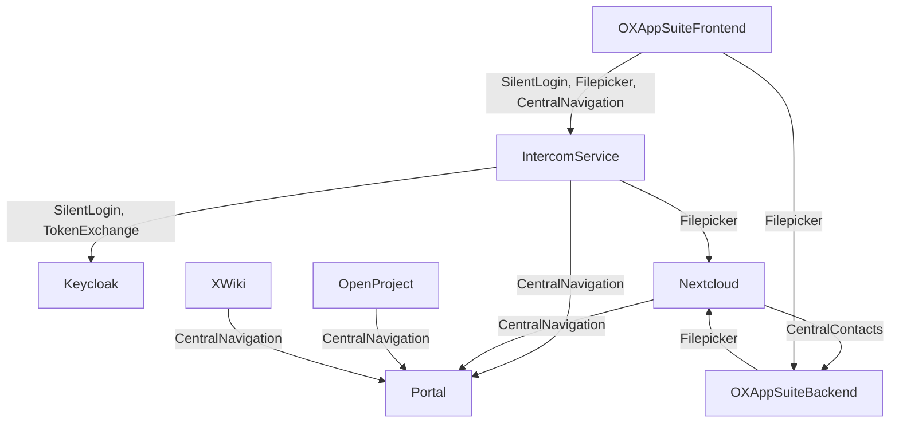
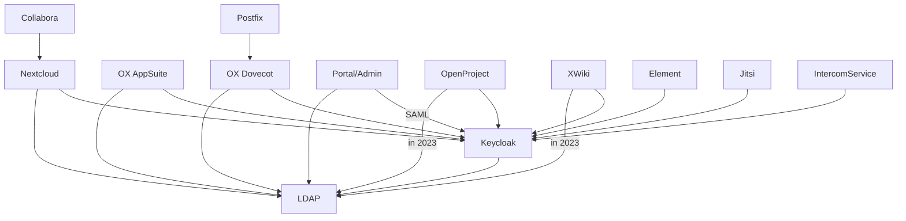

<!--
SPDX-FileCopyrightText: 2023 Bundesministerium des Innern und für Heimat, PG ZenDiS "Projektgruppe für Aufbau ZenDiS"
SPDX-License-Identifier: Apache-2.0
-->
**Content / Quick navigation**

[[_TOC_]]

# Disclaimer August 2023

The current state of the SWP is missing one component which is not yet generally available to the public also
outside the SWP (Element Starter Edition), and contains components that will be replaced (e.g. UCS dev container
monolith to be replaced by multiple Univention Management Stack containers).
In the next months we not only expect upstream updates of the functional components within their feature scope but we
are going to address operational issues like monitoring and network policies.

Of course we will also extend the documentation.

In any case we love to get feedback from you! Related to the deployment / contents of this repository please use the [issues within this project](https://gitlab.opencode.de/bmi/souveraener_arbeitsplatz/deployment/sovereign-workplace/-/issues).

If you want to address other topics, please check the section ["Rückmeldungen und Beteiligung" of the Infos' project OVERVIEW.md](https://gitlab.opencode.de/bmi/souveraener_arbeitsplatz/info/-/blob/main/OVERVIEW.md#rückmeldungen-und-beteiligung).

The first release of the SWP is scheduled for December 2023. Before that release there will be breaking changes in the deployment.

# The Sovereign Workplace (SWP)

The SWP's runtime environment is [Kubernetes](https://kubernetes.io/), often written in it's short form "K8s".

While not all components are perfectly shaped for the execution as containers, one of the projects objectives is the
make the applications more aligned with best practise when it comes to container design and operations.

This documentation gives you - hopefully - all you need to setup your own instance of the SWP. You should have at least
basic knowledge Kubernetes and Devops knowledge.

To have an overview of what can be found at Open CoDE and the basic components of the SWP, please check out the
[OVERVIEW.md](https://gitlab.opencode.de/bmi/souveraener_arbeitsplatz/info/-/blob/main/OVERVIEW.md) in the
[Info repository](https://gitlab.opencode.de/bmi/souveraener_arbeitsplatz/info).

Especially check out the section
["Mitwirkung und Beteiligung"](https://gitlab.opencode.de/bmi/souveraener_arbeitsplatz/info/-/blob/main/OVERVIEW.md#mitwirkung-und-beteiligung)
if you are missing something or you have questions. We appreciate your feedback to improve product and documentation.

# Deployment

**Note for project members:** You can use the project's `dev` K8s cluster to setup your own development instance. Please see the project `sovereign-workplace-env` on the internal Gitlab for more details.

## Prerequisites

### Mandatory technical prerequisites

You have to take care about the following prerequisites in order to deploy the SWP:

- Vanilla K8s cluster
- Domain and DNS Service
- Ingress controller (supported are nginx-ingress, ingress-nginx, HAProxy)
- [Helm](https://helm.sh/), [HelmFile](https://helmfile.readthedocs.io/en/latest/) and
[HelmDiff](https://github.com/databus23/helm-diff)
- Volume provisioner supporting RWO (read-write-once)
- Certificate handling with [cert-manager](https://cert-manager.io/)
- [Istio](https://istio.io/) is currently required to deploy and operate OX AppSuite8, we are working with Open-Xchange
to get rid of this dependency.

#### TLS Certificate

The setup will create a `cert-manager.io` Certificate resource.

You can set the ClusterIssuer via `certificate.issuerRef.name`

### Required input variables

You need to expose following variables to run the installation.

| name                | default                      | description                                       |
|---------------------|------------------------------|---------------------------------------------------|
| `DOMAIN`            | `souvap-univention.de`       | External reachable domain                         |
| `ISTIO_DOMAIN`      | `istio.souvap-univention.de` | External reachable domain for Istio Gateway       |
| `MASTER_PASSWORD`   | `sovereign-workplace`        | The password that seeds the autogenerated secrets |
| `SMTP_PASSWORD`     |                              | Password for SMTP relay gateway                   |
| `TURN_CREDENTIALS`  |                              | Credentials for coturn server                     |

Please ensure you have set DNS records pointing to the respective loadbalancer/IP for `DOMAIN` and `ISTIO_DOMAIN`.

If you want inbound mail also use MX records that point to the Postfix's pods public IP.

More details on the DNS options incl. SPF/DKIM and autodiscovery options to come...

### Optional or feature based prerequisites

All of these requirements are optional as long as you do not want to make use of the given feature.

| Feature                      | Component(s)   | Requirement                 |
|------------------------------|----------------|-----------------------------|
| Component Scalability        | Various[^1]    | Read-Write-Many Provisioner |
| Sending outbound emails      | Various        | SMTP relay/gateway          |
| S/MIME Support               | OX AppSuite8   | PKI / CI                    |
| Improved videoconferencing   | Jitsi          | STUN/TURN server            |

## CI based deployment

The project includes a `.gitlab-ci.yml` that allows you to execute the deployment from a Gitlab instance of your choice.

Please ensure you provide the variables listed in the `Required input variables` section.

When starting the CI through the Gitlab UI you will be queried for some of the variables plus the following ones:

- `BASE_DOMAIN`: The base domain the SWP will be installed at e.g. `souvap.cloud`
- `NAMESPACE`: Defines into which namespace of your K8s cluster the SWP will be installed
- `MASTER_PASSWORD_WEB_VAR`: Overwrite value of `MASTER_PASSWORD`

Based on your input the following variables will be set:
- `DOMAIN` = `NAMESPACE`.`BASE_DOMAIN`
- `ISTIO_DOMAIN` = istio.`DOMAIN`
- `MASTER_PASSWORD` = `MASTER_PASSWORD_WEB_VAR` if that is not given `MASTER_PASSWORD` will be used, that could be set as masked CI variable in Gitlab or as a fallback the default value of `MASTER_PASSWORD`.

You might want to set password / credential variables in the projects `Settings` > `CI/CD` > `Variables`.

## Local deployment

Please ensure you have set the `Required input variables` (see section above) and have also read the `Helmfile` section below for non default configurations. Then go with

```shell
helmfile apply -n <NAMESPACE>
```

and wait. After the deployment are finished some bootstrapping is executed which might take some more minutes before you can login.

## Logging in

When successfully deployed the SWP all K8s jobs from the deployment should be in the status `Succeeded` and all pods should be up an `Running`.

You should see the portal's login page at `https://portal.<DOMAIN>`.

Off the shelf you get two accounts with passwords you can lookup in the `univention-corporate-container-*` pod environment:

| Username / Login   | Password environment variable  |
|--------------------|--------------------------------|
| default.user       | DEFAULT_ACCOUNT_USER_PASSWORD  |
| default.admin      | DEFAULT_ACCOUNT_ADMIN_PASSWORD |

If you do not see any tiles in the portal after the login you may want to wait a couple of minutes, as on the initial start some bootstrapping and cache building is done, that blocks the portal entries from showing up.

# Helmfile

## Custom Configuration

### Deployment selection

By default all components are deployed. The components of type `Eval` are used for development and evaluation
purposes only and need to be replaced in production deployments. These components are grouped together in the
subdirectory `/helmfile/apps/services`.

| Component                   | Name                                | Default | Description                  | Type       |
|-----------------------------|-------------------------------------|---------|------------------------------|------------|
| Certificates                | `certificates.enabled`              | `true`  | TLS certificates             | Eval       |
| ClamAV (Distributed)        | `clamavDistributed.enabled`         | `false` | Antivirus engine             | Eval       |
| ClamAV (Simple)             | `clamavSimple.enabled`              | `true`  | Antivirus engine             | Eval       |
| Collabora                   | `collabora.enabled`                 | `true`  | Weboffice                    | Functional |
| Dovecot                     | `dovecot.enabled`                   | `true`  | Mail backend                 | Functional |
| Intercom Service            | `intercom.enabled`                  | `true`  | Cross service data exchange  | Functional |
| Jitsi                       | `jitsi.enabled`                     | `true`  | Videoconferencing            | Functional |
| Keycloak                    | `keycloak.enabled`                  | `true`  | Identity Provider            | Functional |
| MariaDB                     | `mariadb.enabled`                   | `true`  | Database                     | Eval       |
| Nextcloud                   | `nextcloud.enabled`                 | `true`  | File share                   | Functional |
| OpenProject                 | `openproject.enabled`               | `true`  | Project management           | Functional |
| OX Appsuite                 | `oxAppsuite.enabled`                | `true`  | Groupware                    | Functional |
| Provisioning                | `oxConnector.enabled`               | `true`  | Backend provisioning         | Functional |
| Postfix                     | `postfix.enabled`                   | `true`  | MTA                          | Eval       |
| PostgreSQL                  | `postgresql.enabled`                | `true`  | Database                     | Eval       |
| Redis                       | `redis.enabled`                     | `true`  | Cache Database               | Eval       |
| Univention Corporate Server | `univentionCorporateServer.enabled` | `true`  | Identity Management & Portal | Functional |
| XWiki                       | `xwiki.enabled`                     | `true`  | Knowledgebase                | Functional |


#### Cluster capabilities
| Capability                          | Default         | Options                                 | Notes                                                                                                                                                             |
|-------------------------------------|-----------------|-----------------------------------------|-------------------------------------------------------------------------------------------------------------------------------------------------------------------|
| `cluster.service.type`              | `LoadBalancer`  | `ClusterIP`, `NodePort`, `LoadBalancer` | External access to TCP/UDP services. [Additional Information](https://kubernetes.io/docs/concepts/services-networking/service/#publishing-services-service-types) |
| `cluster.persistence.readWriteMany` | `false`         | `true`, `false`                         | Enable if ReadWriteMany (RWX) storage is available (f.e. CephFS, NFS, ...).                                                                                       |
| `cluster.networking.domain`         | `cluster.local` |                                         | Kubernetes cluster domain.                                                                                                                                        |
| `cluster.networking.cidr`           | `10.0.0.0/8`    |                                         | Kubernetes internal network                                                                                                                                       |


#### Databases

In case you don't got for a develop or evaluation environment you want to point the application to your own database instances.

| Component   | Name               | Type       | Parameter | Key                                    | Default                    |
|-------------|--------------------|------------|-----------|----------------------------------------|----------------------------|
| Keycloak    | Keycloak           | PostgreSQL |           |                                        |                            |
|             |                    |            | Name      | `databases.keycloak.name`              | `keycloak`                 |
|             |                    |            | Host      | `databases.keycloak.host`              | `postgresql`               |
|             |                    |            | Port      | `databases.keycloak.port`              | `5432`                     |
|             |                    |            | Username  | `databases.keycloak.username`          | `keycloak_user`            |
|             |                    |            | Password  | `databases.keycloak.password`          |                            |
|             | Keycloak Extension | PostgreSQL |           |                                        |                            |
|             |                    |            | Name      | `databases.keycloakExtension.name`     | `keycloak_extensions`      |
|             |                    |            | Host      | `databases.keycloakExtension.host`     | `postgresql`               |
|             |                    |            | Port      | `databases.keycloakExtension.port`     | `5432`                     |
|             |                    |            | Username  | `databases.keycloakExtension.username` | `keycloak_extensions_user` |
|             |                    |            | Password  | `databases.keycloakExtension.password` |                            |
| Nextcloud   | Nextcloud          | MariaDB    |           |                                        |                            |
|             |                    |            | Name      | `databases.nextcloud.name`             | `nextcloud`                |
|             |                    |            | Host      | `databases.nextcloud.host`             | `mariadb`                  |
|             |                    |            | Username  | `databases.nextcloud.username`         | `nextcloud_user`           |
|             |                    |            | Password  | `databases.nextcloud.password`         |                            |
| OpenProject | Keycloak           | PostgreSQL |           |                                        |                            |
|             |                    |            | Name      | `databases.openproject.name`           | `openproject`              |
|             |                    |            | Host      | `databases.openproject.host`           | `postgresql`               |
|             |                    |            | Port      | `databases.openproject.port`           | `5432`                     |
|             |                    |            | Username  | `databases.openproject.username`       | `openproject_user`         |
|             |                    |            | Password  | `databases.openproject.password`       |                            |
| OX Appsuite | OX Appsuite        | MariaDB    |           |                                        |                            |
|             |                    |            | Name      | `databases.oxAppsuite.name`            | `CONFIGDB`                 |
|             |                    |            | Host      | `databases.oxAppsuite.host`            | `mariadb`                  |
|             |                    |            | Username  | `databases.oxAppsuite.username`        | `root`                     |
|             |                    |            | Password  | `databases.oxAppsuite.password`        |                            |
| XWiki       | XWiki              | MariaDB    |           |                                        |                            |
|             |                    |            | Name      | `databases.xwiki.name`                 | `xwiki`                    |
|             |                    |            | Host      | `databases.xwiki.host`                 | `mariadb`                  |
|             |                    |            | Username  | `databases.xwiki.username`             | `xwiki_user`               |
|             |                    |            | Password  | `databases.xwiki.password`             |                            |

### Scaling

Replicas for components can be increased, while we still have to look in the actual scalability of the
components (see column `Scales at least to 2`).

| Component   | Name                   | Default | Service            | Scaling            | Scales at least to 2 |
|-------------|------------------------|---------|--------------------|--------------------|----------------------|
| ClamAV      | `replicas.clamav`      | `1`     | :white_check_mark: | :white_check_mark: | not tested           |
|             | `replicas.clamd`       | `1`     | :white_check_mark: | :white_check_mark: | not tested           |
|             | `replicas.freshclam`   | `1`     | :white_check_mark: | :x:                | not tested           |
|             | `replicas.icap`        | `1`     | :white_check_mark: | :white_check_mark: | not tested           |
|             | `replicas.milter`      | `1`     | :white_check_mark: | :white_check_mark: | not tested           |
| Collabora   | `replicas.collabora`   | `1`     | :white_check_mark: | :white_check_mark: | not tested           |
| Dovecot     | `replicas.dovecot`     | `1`     | :white_check_mark: | :x:                | not tested           |
| Jitsi       | `replicas.jibri`       | `1`     | :white_check_mark: | :white_check_mark: | not tested           |
|             | `replicas.jicofo`      | `1`     | :white_check_mark: | :white_check_mark: | not tested           |
|             | `replicas.jitsi `      | `1`     | :white_check_mark: | :white_check_mark: | not tested           |
|             | `replicas.jvb `        | `1`     | :white_check_mark: | :x:                | tested               |
| Keycloak    | `replicas.keycloak`    | `1`     | :white_check_mark: | :white_check_mark: | not tested           |
| Nextcloud   | `replicas.nextcloud`   | `1`     | :white_check_mark: | :white_check_mark: | not tested           |
| OpenProject | `replicas.openproject` | `1`     | :white_check_mark: | :white_check_mark: | not tested           |
| Postfix     | `replicas.postfix`     | `1`     | :white_check_mark: | :x:                | not tested           |
| XWiki       | `replicas.xwiki`       | `1`     | :white_check_mark: | :white_check_mark: | not tested           |


# Component integration

## Functional use cases

### Overview

Some use cases require inter component integration.



#### Intercom Service (ICS)

The UCS Intercom Service's role is to enable cross application integration based on browser interaction. Handling authentication when frontend of application A is using API from application B is often a challenge. For more details on the ICS please refer to it's separate [README.md](./helmfile/apps/intercom-service/README.md) - (**TODO**)

In order to establish a session with the ICS the application makes use of the ICS must initiate a silent login.

Currently only OX AppSuite is using the frontend based integration and therefore it's the only consumer of the ICS API endpoints.

### Filepicker

The Nextcloud filepicker is integrated into the OX AppSuite allows you for adding attachments or links to files from and saving attachments to Nextcloud. The filepicker is using frontend based integration (OX AppSuite in the browser talking to Intercom service) as well as backend to backend integration e.g. (OX AppSuite middleware talking to Nextcloud). The latter one especially when adding a file to an email or storing an file into Nextcloud.

### Central Navigation

The central navigation is based on an API endpoint in the portal that provides the contents of the portal for a user in order to allow components to render the menu showing all available SWP applications for the user.

### (Read & write) Central contacts

Open-Xchange App Suite is the place to manage contacts within the SWP. There is a standard API in the AppSuite that is being used by Nextcloud to lookup contacts as well as to create contacts e.g. if a file is shared with a not yet available personal contact.

# Identity data flows

An overview on
- components that consume data from the ldap, in most cases using a dedicated ldap search account and
- components using Keycloak as IdP, if not otherwise denoted based on the OAuth2 / OIDC flows.

Some components trust others to handle authentication for them.



# Provisioning

Currently active provisioning is only done for OX AppSuite. The OX-Connector synchronizes create, modify and delete acitivities for the following objects to the OX AppSuite using the AppSuite's SOAP API:

- Contexts
- Users
- Groups
- Functional Mailboxes
- Resources

# Component specific documentation

We want to provide more information per component in separate, component specific `README.md` files. In order to establish a common view on the components we are going to cover various aspects:

- **Component overview**: Should provide a quick introduction with the components prerequisites and subcomponents (f.e. pods).
- **Resources**: Will contain link to the components upstream documentation, the helm chart and image locations.
- **Operational Capabilities**
  - **Install**: The components installs within the SWP.
  - **Restart**: Deleting and restarting pods works seamlessly.
  - **Update**: Redeploying the component with a different configuration works as expected. The component makes use of the updates configuration afterwards.
  - **Upgrade**: Component allows to upgrade existing deployments with more current versions of itself.
  - **Secrets**: The component uses K8s secrets.
  - **Logging**: Only logging to STDOUT, no logs inside the container.
  - **Monitoring**: Application provides based on kube-prometheus-stack CRD: ServiceMonitor and PrometheusRule. Optional: Grafana Dashboard.
  - **Scale**: If supported (as we use community products) the component should be manually scalable. Optional: Autoscaling.
  - **Network policies**: Deny by default, allow application related traffic.
  - **Uninstall**: Documented and working complete uninstallation of the component.
- **Debugging**: Some helpful information when it comes to debugging a component, e.g. setting log level.

## Links to component README.mds

- [Intercom-Service](./helmfile/apps/intercom-service/README.md)

## Tests

There is a frontend end-to-end test suite that can get triggered if the
deployment is performed via a Gitlab pipeline.

Currently, the test suite is in progress to be published, so right now it is
only usable by project members. But that will change soon, and it could be used
to create custom tests and perform them after deployment.

The deployment pipeline provides a variable named `TESTS_PROJECT_URL` that
points to the test pipeline residing in another Gitlab repository. At the end of
the deployment the test pipeline is triggered. Tests are just performed for
components that have been deployed prior.


# Footnotes

[^1] Required for scaling components Nextcloud, Dovecot and ClamAV Distributed.
