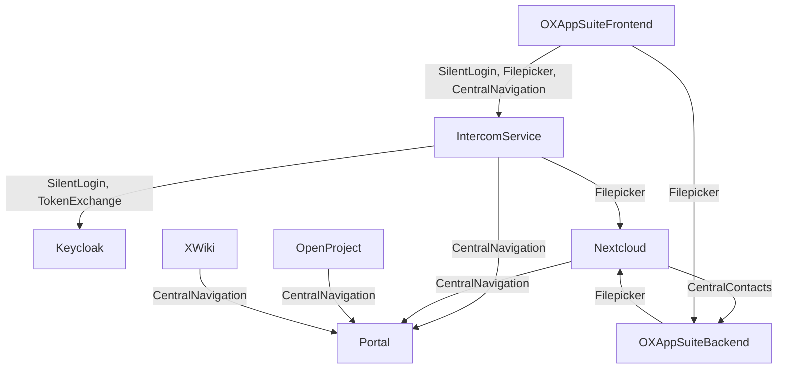
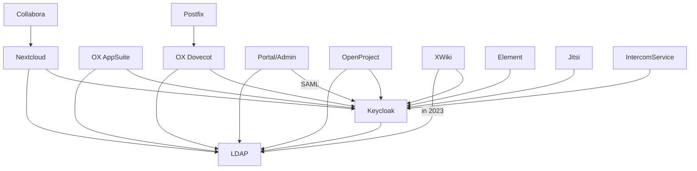

<!--
SPDX-FileCopyrightText: 2023 Bundesministerium des Innern und für Heimat, PG ZenDiS "Projektgruppe für Aufbau ZenDiS"
SPDX-License-Identifier: Apache-2.0
-->
**Content / Quick navigation**

[[_TOC_]]

# Disclaimer August 2023

The current state of the Sovereign Workplace contains components that are going to be
replaced. Like for example the UCS dev container monolith will be substituted by
multiple Univention Management Stack containers.

In the next months we not only expect upstream updates of the functional
components within their feature scope, but we are also going to address
operational issues like monitoring and network policies.

Of course, further development also includes enhancing the documentation.

The first release of the Sovereign Workplace is scheduled for December 2023.
Before that release there will be breaking changes in the deployment.


# The Sovereign Workplace (SWP)

The Sovereign Workplace's runtime environment is [Kubernetes](https://kubernetes.io/), or "K8s" in
short.

While not all components are still perfectly shaped for the execution inside
containers, one of the projects objectives is it to align the applications
with the best practises regarding container design and operations.

This documentation aims to give you all that is needed to set up your own
instance of the Sovereign Workplace. Basic knowledge of Kubernetes and Devops is
required though.

To have an overview of what can be found at Open CoDE and the basic components
of the Sovereign Workplace, please check out the
[OVERVIEW.md](https://gitlab.opencode.de/bmi/souveraener_arbeitsplatz/info/-/blob/main/OVERVIEW.md) in the [Info repository](https://gitlab.opencode.de/bmi/souveraener_arbeitsplatz/info).

We love to get feedback from you! Related to the deployment / contents of this
repository please use the [issues within this project](https://gitlab.opencode.de/bmi/souveraener_arbeitsplatz/deployment/sovereign-workplace/-/issues).

If you want to address other topics, please check the section
["Rückmeldungen und Beteiligung" of the Infos' project OVERVIEW.md](https://gitlab.opencode.de/bmi/souveraener_arbeitsplatz/info/-/blob/main/OVERVIEW.md#rückmeldungen-und-beteiligung).

# Releases

All technical releases are created using [Semantic Versioning](https://semver.org/lang/de/).

Gitlab provides an [overview on the releases](https://gitlab.opencode.de/bmi/souveraener_arbeitsplatz/deployment/sovereign-workplace/-/releases) of this project.

The following release artefacts are provided beside the default source code assets:
- `chart-index.json`: An overview of all Helm charts used by the release.
- `image-index.json`: An overview of all container images used by the release.
# Deployment

**Note for project members:** You can use the project's `dev` K8s cluster to set
up your own instance for development purposes. Please see the project
`sovereign-workplace-env` on the internal Gitlab for more details.

## Prerequisites

### Mandatory technical prerequisites

These are the requirements of the Sovereign Workplace deployment:

- Vanilla K8s cluster
- Domain and DNS Service
- Ingress controller (supported are nginx-ingress, ingress-nginx, HAProxy)
- [Helm](https://helm.sh/), [HelmFile](https://helmfile.readthedocs.io/en/latest/) and
[HelmDiff](https://github.com/databus23/helm-diff)
- Volume provisioner supporting RWO (read-write-once)
- Certificate handling with [cert-manager](https://cert-manager.io/)
- [Istio](https://istio.io/) is currently required to deploy and operate OX AppSuite8, we are talking to Open-Xchange and will try to get rid of this dependency.

#### TLS Certificate

The setup will create a `cert-manager.io` Certificate resource.

You can set the ClusterIssuer via `certificate.issuerRef.name`

### Required input variables

You need to expose following environment variables in order to run the
installation.

| name                | default               | description                                       |
|---------------------|-----------------------|---------------------------------------------------|
| `DOMAIN`            | `souvap.cloud`        | External reachable domain                         |
| `ISTIO_DOMAIN`      | `istio.souvap.cloud`  | External reachable domain for Istio Gateway       |
| `MASTER_PASSWORD`   | `sovereign-workplace` | The password that seeds the autogenerated secrets |
| `SMTP_PASSWORD`     |                       | Password for SMTP relay gateway                   |
| `TURN_CREDENTIALS`  |                       | Credentials for coturn server                     |

Please ensure that you set the DNS records pointing to the loadbalancer/IP for
`DOMAIN` and `ISTIO_DOMAIN`.

If you want inbound email you need to set the MX records that points to the
public IP address of the Postfix-pods.

More details on DNS options including SPF/DKIM and autodiscovery options
are to come...

### Optional or feature based prerequisites

All of these requirements are optional as long as you do not want to use the
related feature.

| Feature                      | Component(s)   | Requirement                 |
|------------------------------|----------------|-----------------------------|
| Component Scalability        | Various[^1]    | Read-Write-Many Provisioner |
| Sending outbound emails      | Various        | SMTP relay/gateway          |
| S/MIME Support               | OX AppSuite8   | PKI / CI                    |
| Improved videoconferencing   | Jitsi          | STUN/TURN server            |

## CI based deployment

The project includes a `.gitlab-ci.yml` that allows you to execute the
deployment from a Gitlab instance of your choice.

Please ensure to provide the environment variables listed at
[Required input variables](#required-input-variables).

When starting the pipeline through the Gitlab UI you will be queried for some
of the variables plus the following ones:

- `BASE_DOMAIN`: The base domain the SWP will use. For example: `souvap.cloud`
- `NAMESPACE`: Defines into which namespace of your K8s cluster the SWP will be installed
- `MASTER_PASSWORD_WEB_VAR`: Overwrites value of `MASTER_PASSWORD`

Based on your input the following variables will be set:
- `DOMAIN` = `NAMESPACE`.`BASE_DOMAIN`
- `ISTIO_DOMAIN` = istio.`DOMAIN`
- `MASTER_PASSWORD` = `MASTER_PASSWORD_WEB_VAR`. If `MASTER_PASSWORD_WEB_VAR`
is not set, the default for `MASTER_PASSWORD` will be used, unless you set
`MASTER_PASSWORD` as a masked CI/CD variable in Gitlab to supercede the default.

You might want to set credential variables in the Gitlab project at
`Settings` > `CI/CD` > `Variables`.

## Local deployment

Please ensure to provide the environment variables listed at
[Required input variables](#required-input-variables).
Also, please read [Helmfile](#helmfile) a little below in case of a non default
configuration.

Then go with

```shell
helmfile apply -n <NAMESPACE>
```

and wait a little. After the deployment is finished some bootstrapping is
executed which might take some more minutes before you can log in your new
instance.

## Offline deployment

Before executing a [local deployment](#local-deployment), you can set following
environment variables to use your own container image and helm chart registry:

| name                         | description                    |
|------------------------------|--------------------------------|
| PRIVATE_CHART_REPOSITORY_URL | Your helm chart repository url |
| PRIVATE_IMAGE_REGISTRY_URL   | Your image registry url        |

## Logging in

When successfully deployed the SWP, all K8s jobs from the deployment should be
in the status `Succeeded` and all pods should be `Running`.

You should see the portal's login page at `https://portal.<DOMAIN>`.

Off the shelf you get two accounts with passwords you can look up in the
`univention-corporate-container-*` pod environment. You can use a shell on that
container or a `kubectl describe`-command to get the credentials.

| Username / Login   | Password environment variable  |
|--------------------|--------------------------------|
| default.user       | DEFAULT_ACCOUNT_USER_PASSWORD  |
| default.admin      | DEFAULT_ACCOUNT_ADMIN_PASSWORD |

If you do not see any tiles in the portal after the login you may want to wait a
couple of minutes, as on the initial start some bootstrapping and cache building
is done. This blocks the portal entries from showing up.

# Helmfile

## Custom Configuration

### Deployment selection

By default, all components are deployed. The components of type `Eval` are used
for development and evaluation purposes only - they need to be replaced in
production deployments. These components are grouped together in the
subdirectory `/helmfile/apps/services`.

| Component                   | Name                                | Default | Description                    | Type       |
|-----------------------------|-------------------------------------|---------|--------------------------------|------------|
| Certificates                | `certificates.enabled`              | `true`  | TLS certificates               | Eval       |
| ClamAV (Distributed)        | `clamavDistributed.enabled`         | `false` | Antivirus engine               | Eval       |
| ClamAV (Simple)             | `clamavSimple.enabled`              | `true`  | Antivirus engine               | Eval       |
| Collabora                   | `collabora.enabled`                 | `true`  | Weboffice                      | Functional |
| Dovecot                     | `dovecot.enabled`                   | `true`  | Mail backend                   | Functional |
| Element                     | `element.enabled`                   | `true`  | Secure communications platform | Functional |
| Intercom Service            | `intercom.enabled`                  | `true`  | Cross service data exchange    | Functional |
| Jitsi                       | `jitsi.enabled`                     | `true`  | Videoconferencing              | Functional |
| Keycloak                    | `keycloak.enabled`                  | `true`  | Identity Provider              | Functional |
| MariaDB                     | `mariadb.enabled`                   | `true`  | Database                       | Eval       |
| Nextcloud                   | `nextcloud.enabled`                 | `true`  | File share                     | Functional |
| OpenProject                 | `openproject.enabled`               | `true`  | Project management             | Functional |
| OX Appsuite                 | `oxAppsuite.enabled`                | `true`  | Groupware                      | Functional |
| Provisioning                | `oxConnector.enabled`               | `true`  | Backend provisioning           | Functional |
| Postfix                     | `postfix.enabled`                   | `true`  | MTA                            | Eval       |
| PostgreSQL                  | `postgresql.enabled`                | `true`  | Database                       | Eval       |
| Redis                       | `redis.enabled`                     | `true`  | Cache Database                 | Eval       |
| Univention Corporate Server | `univentionCorporateServer.enabled` | `true`  | Identity Management & Portal   | Functional |
| XWiki                       | `xwiki.enabled`                     | `true`  | Knowledgebase                  | Functional |


#### Cluster capabilities
| Capability                          | Default         | Options                                 | Notes                                                                                                                                                             |
|-------------------------------------|-----------------|-----------------------------------------|-------------------------------------------------------------------------------------------------------------------------------------------------------------------|
| `cluster.service.type`              | `LoadBalancer`  | `ClusterIP`, `NodePort`, `LoadBalancer` | External access to TCP/UDP services. [Additional Information](https://kubernetes.io/docs/concepts/services-networking/service/#publishing-services-service-types) |
| `cluster.persistence.readWriteMany` | `false`         | `true`, `false`                         | Enable if ReadWriteMany (RWX) storage is available (f.e. CephFS, NFS, ...).                                                                                       |
| `cluster.networking.domain`         | `cluster.local` |                                         | Kubernetes cluster domain.                                                                                                                                        |
| `cluster.networking.cidr`           | `10.0.0.0/8`    |                                         | Kubernetes internal network                                                                                                                                       |


#### Databases

In case you don't got for a develop or evaluation environment you want to point
the application to your own database instances.

| Component   | Name               | Type       | Parameter | Key                                    | Default                    |
|-------------|--------------------|------------|-----------|----------------------------------------|----------------------------|
| Element     | Synapse            | PostgreSQL |           |                                        |                            |
|             |                    |            | Name      | `databases.synapse.name`               | `matrix`                   |
|             |                    |            | Host      | `databases.synapse.host`               | `postgresql`               |
|             |                    |            | Port      | `databases.synapse.port`               | `5432`                     |
|             |                    |            | Username  | `databases.synapse.username`           | `matrix_user`              |
|             |                    |            | Password  | `databases.synapse.password`           |                            |
| Keycloak    | Keycloak           | PostgreSQL |           |                                        |                            |
|             |                    |            | Name      | `databases.keycloak.name`              | `keycloak`                 |
|             |                    |            | Host      | `databases.keycloak.host`              | `postgresql`               |
|             |                    |            | Port      | `databases.keycloak.port`              | `5432`                     |
|             |                    |            | Username  | `databases.keycloak.username`          | `keycloak_user`            |
|             |                    |            | Password  | `databases.keycloak.password`          |                            |
|             | Keycloak Extension | PostgreSQL |           |                                        |                            |
|             |                    |            | Name      | `databases.keycloakExtension.name`     | `keycloak_extensions`      |
|             |                    |            | Host      | `databases.keycloakExtension.host`     | `postgresql`               |
|             |                    |            | Port      | `databases.keycloakExtension.port`     | `5432`                     |
|             |                    |            | Username  | `databases.keycloakExtension.username` | `keycloak_extensions_user` |
|             |                    |            | Password  | `databases.keycloakExtension.password` |                            |
| Nextcloud   | Nextcloud          | MariaDB    |           |                                        |                            |
|             |                    |            | Name      | `databases.nextcloud.name`             | `nextcloud`                |
|             |                    |            | Host      | `databases.nextcloud.host`             | `mariadb`                  |
|             |                    |            | Username  | `databases.nextcloud.username`         | `nextcloud_user`           |
|             |                    |            | Password  | `databases.nextcloud.password`         |                            |
| OpenProject | Keycloak           | PostgreSQL |           |                                        |                            |
|             |                    |            | Name      | `databases.openproject.name`           | `openproject`              |
|             |                    |            | Host      | `databases.openproject.host`           | `postgresql`               |
|             |                    |            | Port      | `databases.openproject.port`           | `5432`                     |
|             |                    |            | Username  | `databases.openproject.username`       | `openproject_user`         |
|             |                    |            | Password  | `databases.openproject.password`       |                            |
| OX Appsuite | OX Appsuite        | MariaDB    |           |                                        |                            |
|             |                    |            | Name      | `databases.oxAppsuite.name`            | `CONFIGDB`                 |
|             |                    |            | Host      | `databases.oxAppsuite.host`            | `mariadb`                  |
|             |                    |            | Username  | `databases.oxAppsuite.username`        | `root`                     |
|             |                    |            | Password  | `databases.oxAppsuite.password`        |                            |
| XWiki       | XWiki              | MariaDB    |           |                                        |                            |
|             |                    |            | Name      | `databases.xwiki.name`                 | `xwiki`                    |
|             |                    |            | Host      | `databases.xwiki.host`                 | `mariadb`                  |
|             |                    |            | Username  | `databases.xwiki.username`             | `xwiki_user`               |
|             |                    |            | Password  | `databases.xwiki.password`             |                            |

### Scaling

The Replicas of components can be increased, while we still have to look in the
actual scalability of the components (see column `Scales at least to 2`).

| Component   | Name                   | Default | Service            | Scaling            | Scales at least to 2 |
|-------------|------------------------|---------|--------------------|--------------------|----------------------|
| ClamAV      | `replicas.clamav`      | `1`     | :white_check_mark: | :white_check_mark: | not tested           |
|             | `replicas.clamd`       | `1`     | :white_check_mark: | :white_check_mark: | not tested           |
|             | `replicas.freshclam`   | `1`     | :white_check_mark: | :x:                | not tested           |
|             | `replicas.icap`        | `1`     | :white_check_mark: | :white_check_mark: | not tested           |
|             | `replicas.milter`      | `1`     | :white_check_mark: | :white_check_mark: | not tested           |
| Collabora   | `replicas.collabora`   | `1`     | :white_check_mark: | :white_check_mark: | not tested           |
| Dovecot     | `replicas.dovecot`     | `1`     | :white_check_mark: | :x:                | not tested           |
| Element     | `replicas.element`     | `2`     | :white_check_mark: | :white_check_mark: | :white_check_mark:   |
|             | `replicas.synapse`     | `1`     | :white_check_mark: | :x:                | not tested           |
|             | `replicas.synapseWeb`  | `2`     | :white_check_mark: | :white_check_mark: | :white_check_mark:   |
|             | `replicas.wellKnown`   | `2`     | :white_check_mark: | :white_check_mark: | :white_check_mark:   |
| Jitsi       | `replicas.jibri`       | `1`     | :white_check_mark: | :white_check_mark: | not tested           |
|             | `replicas.jicofo`      | `1`     | :white_check_mark: | :white_check_mark: | not tested           |
|             | `replicas.jitsi `      | `1`     | :white_check_mark: | :white_check_mark: | not tested           |
|             | `replicas.jvb `        | `1`     | :white_check_mark: | :x:                | :x:                  |
| Keycloak    | `replicas.keycloak`    | `1`     | :white_check_mark: | :white_check_mark: | not tested           |
| Nextcloud   | `replicas.nextcloud`   | `1`     | :white_check_mark: | :white_check_mark: | not tested           |
| OpenProject | `replicas.openproject` | `1`     | :white_check_mark: | :white_check_mark: | not tested           |
| Postfix     | `replicas.postfix`     | `1`     | :white_check_mark: | :x:                | not tested           |
| XWiki       | `replicas.xwiki`       | `1`     | :white_check_mark: | :white_check_mark: | not tested           |


## Security

This list gives you an overview of default security settings and if they comply with security standards:


| Component  | Process    | allowPrivilegeEscalation (`false`) | capabilities (`drop: ALL`)                               | seccompProfile (`RuntimeDefault`) | readOnlyRootFilesystem (`true`) | runAsNonRoot (`true`) | runAsUser | runAsGroup | fsGroup |
|------------|------------|------------------------------------|----------------------------------------------------------|-----------------------------------|---------------------------------|-----------------------|-----------|------------|---------|
| ClamAV     | clamd      | :white_check_mark:                 | :white_check_mark:                                       | :white_check_mark:                | :white_check_mark:              | :white_check_mark:    | 100       | 101        | 101     |
|            | freshclam  | :white_check_mark:                 | :white_check_mark:                                       | :white_check_mark:                | :white_check_mark:              | :white_check_mark:    | 100       | 101        | 101     |
|            | icap       | :white_check_mark:                 | :white_check_mark:                                       | :white_check_mark:                | :white_check_mark:              | :white_check_mark:    | 100       | 101        | 101     |
|            | milter     | :white_check_mark:                 | :white_check_mark:                                       | :white_check_mark:                | :white_check_mark:              | :white_check_mark:    | 100       | 101        | 101     |
| MariaDB    | mariadb    | :white_check_mark:                 | :white_check_mark:                                       | :white_check_mark:                | :white_check_mark:              | :white_check_mark:    | 1001      | 1001       | 1001    |
| Postfix    | postfix    | :white_check_mark:                 | :x:                                                      | :white_check_mark:                | :x:                             | :x:                   |           |            | 101     |
|            |            |                                    | `DAC_OVERRIDE, FOWNER, SETUID, SETGID, NET_BIND_SERVICE` |                                   |                                 |                       |           |            |         |
| PostgreSQL | postgresql | :white_check_mark:                 | :white_check_mark:                                       | :white_check_mark:                | :white_check_mark:              | :white_check_mark:    | 1001      | 1001       | 1001    |


# Component integration

## Functional use cases

### Overview

Some use cases require inter component integration.



#### Intercom Service (ICS)

The UCS Intercom Service's role is to enable cross application integration based
on browser interaction. Handling authentication when the frontend of an
application is using the API from another application is often a challenge.
For more details on the ICS please refer to its own [README.md](./helmfile/apps/intercom-service/README.md).

In order to establish a session with the Intercom Service, the application that
wants to use the ICS must initiate a silent login.

Currently only OX AppSuite is using the frontend based integration, and
therefore it is right now the only consumer of the ICS API.

### Filepicker

The Nextcloud filepicker which is integrated into the OX AppSuite allows you to
add attachments or links to files from and saving attachments to Nextcloud.

The filepicker is using frontend and backend based integration. Frontend based
integration means that OX AppSuite in the browser is communicating with ICS.
While using backend based integration, OX AppSuite middleware is communicating
with Nextcloud, which is especially used when adding a file to an email or
storing a file into Nextcloud.

### Central Navigation

Central navigation is based on an API endpoint in the portal that provides the
contents of the portal for a user in order to allow components to render the
menu showing all available SWP applications for the user.

### (Read & write) Central contacts

Open-Xchange App Suite is used to manage contacts within the Sovereign
Workplace. There is an API in the AppSuite that is being used by
Nextcloud to lookup contacts as well as to create contacts. This is maybe done
when a file is shared with a not yet available personal contact.

# Identity data flows

An overview of
- components that consume the LDAP service. Mostly by using a dedicated LDAP search account.
- components using Keycloak as identity provider. If not otherwise denoted based on the OAuth2 / OIDC flows.

Some components trust others to handle authentication for them.



# Provisioning

Currently active provisioning is only done for OX AppSuite. The OX-Connector
synchronizes creates, modifies and deletes activities for the following objects
to the OX AppSuite using the AppSuite's SOAP API:

- Contexts
- Users
- Groups
- Functional Mailboxes
- Resources

# Component specific documentation

We want to provide more information per component in separate, component
specific `README.md` files. In order to establish a common view on the
components we are going to cover various aspects:

- **Component overview**: Shall provide a quick introduction including the components prerequisites and subcomponents (f.e. pods).
- **Resources**: Will contain a link to the components upstream documentation, the helm chart and image locations.
- **Operational Capabilities**
  - **Install**: The components installs within the SWP.
  - **Restart**: Deleting and restarting pods works seamlessly.
  - **Update**: Redeploying the component with a different configuration works as expected. The component makes use of the updates configuration afterwards.
  - **Upgrade**: Component allows to upgrade existing deployments with more current versions of itself.
  - **Secrets**: The component uses K8s secrets.
  - **Logging**: Only logging to STDOUT, no logs inside the container.
  - **Monitoring**: Application provides based on kube-prometheus-stack CRD: ServiceMonitor and PrometheusRule. Optional: Grafana Dashboard.
  - **Scale**: If supported (as we use community products) the component should be manually scalable. Optional: Autoscaling.
  - **Network policies**: Deny by default, allow application related traffic.
  - **Uninstall**: Documented and working complete uninstallation of the component.
- **Debugging**: Some helpful information when it comes to debugging a component, e.g. setting log level.

## Links to component README.mds

- [Intercom-Service](./helmfile/apps/intercom-service/README.md)

## Tests

There is a frontend end-to-end test suite that can get triggered if the
deployment is performed via a Gitlab pipeline.

Currently, the test suite is in progress to be published, so right now it is
only usable by project members. But that will change soon, and it could be used
to create custom tests and perform them after deployment.

The deployment pipeline provides a variable named `TESTS_PROJECT_URL` that
points to the test pipeline residing in another Gitlab repository. At the end of
the deployment the test pipeline is triggered. Tests are just performed for
components that have been deployed prior.


# Footnotes

[^1] Required for scaling components Nextcloud, Dovecot and ClamAV Distributed.
