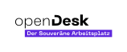

<!--
SPDX-FileCopyrightText: 2023 Bundesministerium des Innern und für Heimat, PG ZenDiS "Projektgruppe für Aufbau ZenDiS"
SPDX-License-Identifier: Apache-2.0
-->

openDesk is a Kubernetes based, open-source and cloud-native digital workplace suite provided by the "Projektgruppe für
Aufbau ZenDiS" of Germany's Federal Ministry of the Interior.

It features:
- Fully integrated Identity Management (Univention, Keycloak)
- File storage (Nextcloud)
- Weboffice (Collabora)
- Videoconference (Jitsi)
- Encrypted Chat (Synapse, Element)
- Groupware (OX Appsuite)
- Wiki (XWiki)
- Notes and Diagrams (Cryptpad, Draw.io)

openDesk integrates these components and is working towards a seamless user experience.

While not all components are perfectly shaped for the execution inside containers, one of the project objectives is to
align the applications with the best practises regarding container design and operations.

This documentation aims to give you all that is needed to set up your own instance of the openDesk.
Basic knowledge of Kubernetes and Devops is required though.

<!-- TOC -->
* [Active development notice](#active-development-notice)
* [Feedback](#feedback)
* [Requirements](#requirements)
* [Getting started](#getting-started)
* [Advanced customization](#advanced-customization)
* [Releases](#releases)
* [Components](#components)
* [License](#license)
* [Copyright](#copyright)
<!-- TOC -->

# Active development notice
openDesk will face breaking changes in the near future without upgrade paths before
[technical release](https://gitlab.opencode.de/bmi/opendesk/deployment/sovereign-workplace/-/releases
v1.0.0 is reached.

While most components support upgrades, major configuration or component changes may occur, therefore we recommend
at the moment always installing from scratch.

Components that are going to be replaced soon are:
- the UCS dev container monolith will be substituted by multiple Univention Management Stack containers,
- the Nextcloud community container is going to be replaced by an openDesk specific Nextcloud distroless container and
- Dovecot Community is going to be replaced by a Dovecot container tailored for the needs of the public sector.

In the next months, we not only expect upstream updates of the functional components within their feature scope, but we
are also going to address operational issues like monitoring and network policies.

Of course, further development also includes enhancing the documentation.

# Feedback

We love to get feedback from you!
Related to the deployment / contents of this repository,
please use the [issues within this project](https://gitlab.opencode.de/bmi/opendesk/deployment/sovereign-workplace/-/issues).

If you want to address other topics, please check the section
["Rückmeldungen und Beteiligung" of the Infos' project OVERVIEW.md](https://gitlab.opencode.de/bmi/opendesk/info/-/blob/main/OVERVIEW.md#rückmeldungen-und-beteiligung).

# Requirements

⟶ Visit our detailed [Requirements](docs/requirements.md) overview.

# Getting started

⟶ Visit our detailed [Getting started](docs/getting-started.md) guide.

# Advanced customization

- [External services](docs/external-services.md)
- [Security](docs/security.md)
- [Scaling](docs/scaling.md)
- [Monitoring](docs/monitoring.md)
- [Theming](docs/theming.md)

# Releases

All technical releases are created using [Semantic Versioning](https://semver.org/lang/de/).

Gitlab provides an
[overview on the releases](https://gitlab.opencode.de/bmi/opendesk/deployment/sovereign-workplace/-/releases)
of this project.

The following release artefacts are provided beside the default source code assets:
- `chart-index.json`: An overview of all Helm charts used by the release.
- `image-index.json`: An overview of all container images used by the release.

# Components

⟶ Visit our detailed [Component](docs/getting-started.md) docs.

# License

This project uses the following license: Apache-2.0

# Copyright
Copyright (C) 2023 Bundesministerium des Innern und für Heimat, PG ZenDiS "Projektgruppe für Aufbau ZenDiS"
