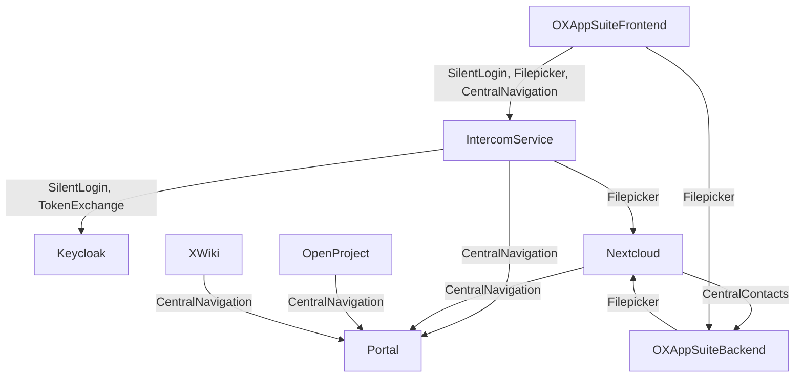
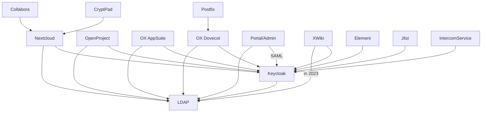

<!--
SPDX-FileCopyrightText: 2023 Bundesministerium des Innern und für Heimat, PG ZenDiS "Projektgruppe für Aufbau ZenDiS"
SPDX-License-Identifier: Apache-2.0
-->
<h1>Components</h1>

This section covers the internal system requirements as well as external service requirements for productive use.

<!-- TOC -->
  * [Overview](#overview)
  * [Component integration](#component-integration)
    * [Intercom Service (ICS)](#intercom-service-ics)
    * [Filepicker](#filepicker)
    * [Central Navigation](#central-navigation)
    * [(Read & write) Central contacts](#read--write-central-contacts)
    * [OpenProject Filestore](#openproject-filestore)
  * [Identity data flows](#identity-data-flows)
  * [Provisioning](#provisioning)
  * [Component specific documentation](#component-specific-documentation)
  * [Links to component docs](#links-to-component-docs)
<!-- TOC -->

## Overview

openDesk consists out of a variety of open-source projects. Here is a list with the description and type.

Components of type `Eval` are used for development and evaluation purposes only,
they need to be replaced in production deployments.

| Component                   | Description                    | Type       |
|-----------------------------|--------------------------------|------------|
| Certificates                | TLS certificates               | Eval       |
| ClamAV (Distributed)        | Antivirus engine               | Eval       |
| ClamAV (Simple)             | Antivirus engine               | Eval       |
| Collabora                   | Weboffice                      | Functional |
| CryptPad                    | Weboffice                      | Functional |
| Dovecot                     | Mail backend                   | Functional |
| Element                     | Secure communications platform | Functional |
| Intercom Service            | Cross service data exchange    | Functional |
| Jitsi                       | Videoconferencing              | Functional |
| Keycloak                    | Identity Provider              | Functional |
| MariaDB                     | Database                       | Eval       |
| Memcached                   | Cache Database                 | Eval       |
| MinIO                       | Object Storage                 | Eval       |
| Nextcloud                   | File share                     | Functional |
| OpenProject                 | Project management             | Functional |
| OX Appsuite                 | Groupware                      | Functional |
| Provisioning                | Backend provisioning           | Functional |
| Postfix                     | MTA                            | Eval       |
| PostgreSQL                  | Database                       | Eval       |
| Redis                       | Cache Database                 | Eval       |
| Univention Corporate Server | Identity Management & Portal   | Functional |
| Univention Management Stack | Identity Management & Portal   | Eval       |
| XWiki                       | Knowledgebase                  | Functional |

## Component integration

Some use cases require inter component integration.

### Intercom Service (ICS)

The UCS Intercom Service's role is to enable cross-application integration based on browser interaction.
Handling authentication when the frontend of an application is using the API from another application is often a
challenge.
For more details on the ICS please refer to its own [doc](./components/intercom-service.md).

To establish a session with the Intercom Service, the application that wants to use the ICS must initiate a silent
login.

Currently only OX AppSuite is using the frontend-based integration, and therefore it is right now the only consumer of
the ICS API.

### Filepicker

The Nextcloud filepicker which is integrated into the OX AppSuite allows you to add attachments or links to files from
and saving attachments to Nextcloud.

The filepicker is using frontend and backend based integration.
Frontend-based integration means that OX AppSuite in the browser is communicating with ICS.
While using backend-based integration, OX AppSuite middleware is communicating with Nextcloud, which is especially used
when adding a file to an email or storing a file into Nextcloud.

### Central Navigation

Central navigation is based on an API endpoint in the portal that provides the contents of the portal for a user to
allow components to render the menu showing all available SWP applications for the user.

### (Read & write) Central contacts

Open-Xchange App Suite is used to manage contacts within openDesk. There is an API in the AppSuite that is being used by
Nextcloud to lookup contacts as well as to create contacts. This is maybe done when a file is shared with a not yet
available personal contact.

### OpenProject Filestore

By default, Nextcloud is a configured option for storing attachments in OpenProject.
The Filestore can be enabled on a per-project level in OpenProject's project admin section.

## Identity data flows

An overview of
- components that consume the LDAP service. Mostly by using a dedicated LDAP search account.
- components using Keycloak as identity provider. If not otherwise denoted based on the OAuth2 / OIDC flows.

Some components trust others to handle authentication for them.

## Provisioning

Currently, active provisioning is only done for OX AppSuite. The OX-Connector is synchronizing, creating, modifying and
deleting activities for the following objects to the OX AppSuite using the AppSuite's SOAP API:

- Contexts
- Users
- Groups
- Functional Mailboxes
- Resources

## Component specific documentation

We want to provide more information per component in separate, component-specific markdown file.
To establish a common view on the components, we are going to cover various aspects:

- **Component overview**: Shall provide a quick introduction including the components prerequisites and subcomponents (f.e. pods).
- **Resources**: Will contain a link to the component upstream documentation, the helm chart and image locations.
- **Operational Capabilities**
  - **Install**: The components install within the SWP.
  - **Restart**: Deleting and restarting pods works seamlessly.
  - **Update**: Redeploying the component with a different configuration works as expected. The component makes use of the updates configuration afterwards.
  - **Upgrade**: Component allows upgrading existing deployments with more current versions of itself.
  - **Secrets**: The component uses K8s secrets.
  - **Logging**: Only logging to STDOUT, no logs inside the container.
  - **Monitoring**: Application provides based on kube-prometheus-stack CRD: ServiceMonitor and PrometheusRule. Optional: Grafana Dashboard.
  - **Scale**: If supported (as we use community products) the component should be manually scalable. Optional: Autoscaling.
  - **Network policies**: Deny by default, allow application related traffic.
  - **Uninstall**: Documented and working complete uninstallation of the component.
- **Debugging**: Some helpful information when it comes to debugging a component, e.g. setting log level.

## Links to component docs

- [Intercom-Service](./components/intercom-service.md)
